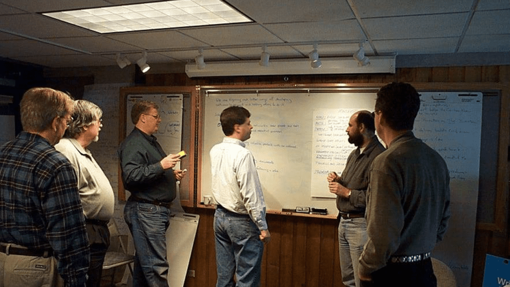

# 📌 O que são Metodologias Ágeis?  

As **metodologias ágeis** representam uma abordagem moderna para o **gerenciamento de projetos de software**, priorizando **flexibilidade, colaboração e entrega contínua de valor**. Surgiram como resposta às limitações dos modelos tradicionais (como o **cascata**), que seguem um planejamento rígido e sequencial, muitas vezes resultando em produtos desalinhados com as necessidades reais do cliente (PRESSMAN, 2016).  

De acordo com Sommerville (2018), o desenvolvimento ágil se baseia em **iterações curtas (sprints)**, onde o software é entregue em **pequenos incrementos funcionais**, permitindo **feedback constante** e **adaptação a mudanças**.  

O Manifesto Ágil surgiu em 2001, durante um encontro de desenvolvedores de software que buscavam alternativas para os processos tradicionais, lentos e inflexíveis. Eles propuseram uma abordagem mais ágil, colaborativa e adaptável, focada em entregar software funcional e de valor para o cliente.

O manifesto se baseia em quatro valores principais:

* **Indivíduos e interações** acima de processos e ferramentas.
* **Software em funcionamento** acima de documentação abrangente.
* **Colaboração com o cliente** acima de negociação de contratos.
* **Responder a mudanças** acima de seguir um plano.

---

## 🚀 Por que usar metodologias ágeis?  

Estudos demonstram que empresas que adotam métodos ágeis apresentam **maior eficiência, redução de custos e maior satisfação do cliente** (SCHWABER; SUTHERLAND, 2020). Entre os principais benefícios, destacam-se:  

🔹 **Flexibilidade e adaptação** → Se houver mudanças no projeto, a equipe consegue se adaptar sem grandes problemas. 
> _"Mudanças nos requisitos são incorporadas sem grandes impactos no cronograma (COHN, 2010)."_

🔹 **Entrega contínua** → O software é entregue em pequenas partes funcionais, garantindo valor ao cliente mais rápido.
>_"O cliente recebe funcionalidades prontas em ciclos curtos (2 a 4 semanas), garantindo valor antecipado (LEFFINGWELL, 2020)."_

🔹 **Melhor colaboração** → Equipes multidisciplinares trabalham juntas, com comunicação constante.  
> _"Equipes multidisciplinares trabalham em conjunto, com comunicação constante (BECK et al., 2001)."_

🔹 **Menos desperdício** → Como as entregas são frequentes, evita-se trabalho desnecessário.  
> _"Práticas como **Kanban** e **Lean** eliminam tarefas desnecessárias, otimizando fluxos (POPPENDIECK; POPPENDIECK, 2003)."_

Os benefícios comprovados por estudos mostram que empresas ágeis têm **30% maior eficiência** e **40% maior satisfação do cliente** (SCHWABER & SUTHERLAND, 2020). Os principais benefícios são:  

| **Vantagem** | **Impacto** | **Base Teórica** |  
|--------------|------------|------------------|  
| 🔹 Flexibilidade | Adaptação a mudanças sem impactar cronogramas | (COHN, 2010) |  
| 🔹 Entregas incrementais | Valor entregue em ciclos de 2-4 semanas | (LEFFINGWELL, 2020) |  
| 🔹 Colaboração intensa | Times multidisciplinares com comunicação diária | (BECK et al., 2001) |  
| 🔹 Redução de desperdício | Eliminação de tarefas desnecessárias | (POPPENDIECK, 2003) |  

**Exemplo prático:** Uma equipe usando Scrum pode reagir a mudanças de requisitos em 1-2 dias, enquanto no modelo cascata levaria semanas para replanejar.

---

## 📜 O Manifesto Ágil  

Em 2001, 17 especialistas em software publicaram o **Manifesto Ágil**, estabelecendo **4 valores fundamentais** (BECK et al., 2001):  

| **Valor Ágil** | **Ênfase** | **Contraste com Métodos Tradicionais** |  
|----------------|------------|--------------------------------------|  
|1️⃣ **Indivíduos e interações** | Pessoas e comunicação direta | Processos e ferramentas rígidas |  
|2️⃣ **Software funcionando** | Entregas práticas e testáveis | Documentação extensa |  
|3️⃣ **Colaboração com o cliente** | Parceria contínua | Negociação de contratos fixos |  
|4️⃣ **Responder a mudanças** | Adaptação rápida | Seguir um plano pré-definido |  

⚠️ Isso não significa que processos, documentação ou contratos não são importantes! Mas o foco principal é na entrega de valor contínua.  ⚠️

💡 Além disso, o manifesto define **12 princípios**, incluindo:  

## 🔥 Principais Metodologias Ágeis  

#### 1️⃣ **Scrum** 🏉 → A mais usada! Estruturada em **sprints** (ciclos curtos de trabalho) e reuniões diárias. 
- **Estrutura**: Baseado em **Sprints** (iterações de 2-4 semanas), com **cerimônias** como:  
  - **Daily Scrum** (reunião diária de 15 min).  
  - **Sprint Planning** (planejamento da iteração).  
  - **Sprint Review** (demonstração do incremento).  
  - **Retrospectiva** (melhoria contínua).  
- **Papéis**: **Product Owner** (visão do produto), **Scrum Master** (facilitação), **Dev Team** (SCHWABER; SUTHERLAND, 2020). 

#### 2️⃣ **Kanban** 📋 → Foco na **visualização do fluxo de trabalho** com quadros e cartões.
- **Foco**: Visualização do fluxo de trabalho (**quadro Kanban**) com limites de WIP (Work in Progress).  
- **Princípios**:  
  - **Visualizar o trabalho** (To Do, Doing, Done).  
  - **Limitar tarefas em andamento**.  
  - **Melhorar continuamente** (ANDERSON, 2010).  
 
#### 3️⃣ **Lean** ⚡ → Redução de desperdício e melhoria contínua.
- **Origem**: Derivado do **Sistema Toyota de Produção**, visa **eliminar desperdícios** (MUDA).  
- **Princípios**:  
  - Reduzir estoque de tarefas.  
  - Entregar rápido com qualidade.  
  - Decidir o mais tarde possível (POPPENDIECK; POPPENDIECK, 2003). 

#### 4️⃣ **XP (Extreme Programming)** 🖥️ → Voltada para desenvolvimento com boas práticas de código.
- **Práticas técnicas**:  
  - **Pair Programming** (programação em pares).  
  - **Testes automatizados (TDD)**.  
  - **Integração contínua (CI)**.  
  - **Refatoração constante** (BECK, 2000).  

#### 5️⃣ **SAFe (Scaled Agile Framework)** 🏗️ → Para empresas grandes que precisam escalar o Ágil.
- **Aplicação**: Para **grandes organizações** que precisam escalar o ágil.  
- **Estrutura**:  
  - **Agile Release Trains (ARTs)**.  
  - **Program Increment (PI) Planning**.  
  - **Hierarquia de times alinhados** (LEFFINGWELL, 2020).

---

## 🎯 Como aplicar no dia a dia?  

✅ Dividir o projeto em **pequenas entregas** (incrementos). **Dividir o projeto em User Stories** (histórias de usuário) e priorizá-las no **Product Backlog**.  

✅ Criar **reuniões curtas** e constantes para alinhar o time.  

✅ Manter um **quadro de tarefas** (físico ou digital). **Usar ferramentas visuais** (Jira, Trello, Azure DevOps) para gerenciar tarefas. 

✅ Definir **papéis claros** dentro da equipe (Scrum Master, Product Owner, Time de Desenvolvimento). Promovendo sempre uma cultura de feedback com revisões e retrospectivas.  

✅ Ouvir o **feedback** dos usuários e melhorar constantemente.  

---

## 💡 Sendo assim...

🔹 **Ágil = flexibilidade + entregas rápidas + colaboração**  
🔹 Baseado no **Manifesto Ágil** (valores e princípios)  
🔹 Tem várias abordagens: **Scrum, Kanban, XP, Lean, SAFe**  
🔹 Aplicável em **qualquer tipo de projeto de software**  
🔹 **Priorizar pessoas e colaboração** sobre burocracia.  
🔹 **Entregar valor incremental** em vez de produtos monolíticos.  
🔹 **Adaptar-se a mudanças** de forma eficiente.  

## **📚 Referências**  
- BECK, K. et al. **Manifesto for Agile Software Development**, 2001.  
- SCHWABER, K.; SUTHERLAND, J. **The Scrum Guide**, 2020.  
- COHN, M. **Succeeding with Agile**, 2010.  
- LEFFINGWELL, D. **SAFe 5.0 Distilled**, 2020.  